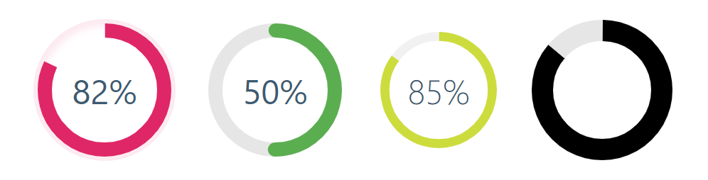

<h1 align="center">
  Circular Progress Bar
</h1>

<p align="center">
  Simple circular progress bar. From now on, one call runs multiple circular-progress-bar.
</p>

<p align="center">
  
  
  <a href="LICENSE">
    
  </a>
</p>

<p align="center">
  
</p>

## Demo

See the demo - [example](https://tomickigrzegorz.github.io/circular-progress-bar/)

## Installation

#### JavaScript

```html
<script src="https://cdn.jsdelivr.net/gh/tomickigrzegorz/circular-progress-bar@1.2.4/dist/circularProgressBar.min.js"></script>
```

##### -- OR --

Just download the library from the `dist/circularProgressBar.min.js` and add it to head:

```js
<script src="./path/to/circularProgressBar.min.js"></script>
```


## Sample configuration

1. Add a div element to the page `<div class="pie" data-pie='{ "percent": 80 }'></div>`
2. Build the script or download it from the `dist` folder and add `circularProgressBar.min.js` to the page, [umd, esm, iife]
3. Call the functions `const circle = new CircularProgressBar('pie'); circle.initial();`

More extensive example:

```html
<div class="pie" data-pie='{ "round": true, "percent": 80, "colorSlice": "#E91E63", "time": 20 }'></div>
<div class="pie" data-pie='{ "lineargradient": ["#ffff00","#ff0000"], "percent": 20, "colorSlice": "#000", "colorCircle": "#e6e6e6", "strokeWidth": 15, "number": false }'></div>
```

Minimal configuration:

```html
<div class="pie" data-pie='{ "percent": 80 }'></div>
```

### Function call

```javascript
// 'pie' is class name div
const circle = new CircularProgressBar("pie");
circle.initial();
```

### IntersectionObserver
Automatic animation start when the progress bar appears in the page view.

```js
window.addEventListener('DOMContentLoaded', () => {
  // get all progress bar
  const elements = [].slice.call(document.querySelectorAll('.pie'));
  // call to function
  const circle = new CircularProgressBar('pie');

  // https://developer.mozilla.org/en-US/docs/Web/API/Intersection_Observer_API
  // if IntersectionObserver is supported by the browser
  if ('IntersectionObserver' in window) {
    const config = {
      root: null,
      rootMargin: '0px',
      threshold: 0.75,
    };

    const ovserver = new IntersectionObserver((entries, observer) => {
      entries.map((entry) => {
        if (entry.isIntersecting && entry.intersectionRatio >= 0.75) {
          circle.initial(entry.target);
          observer.unobserve(entry.target);
        }
      });
    }, config);

    elements.map((item) => {
      ovserver.observe(item);
    });
  } else {
    // if the browser does not support IntersectionObserver
    // we run all progress bars at once
    elements.map((element) => {
      circle.initial(element);
    });
  }
});
```

### Update progress bar dynamically

Below there are properties that we can change dynamically

```js
const circle = new CircularProgressBar("pie");
circle.initial();

setTimeout(() => {
  const options = {
    // item number you want to update
    // read data-pie-index from the element
    index: 1,
    // update props
    percent: 30,
    colorSlice: "salmon",
    fontColor: "salmon",
    fontSize: "1.2rem",
    fontWeight: 600
  };
  circle.animationTo(options);
}, 3000); // after 3s update
```

Modification of these elements `fontColor`,` fontSize`, `fontWeight` is also available from the level of css. The svg text and tspan elements have unique classes on the basis of which we can modify them.

```svg
<text class="pie-text-1" x="50%" y="50%" fill="#000" font-size="1.6rem" font-weight="400" text-anchor="middle" dy="0.35em">
  <tspan class="pie-percent-1">75</tspan>
  <tspan class="pie-unit-1">%</tspan>
</text>
```

```css
.pie-text-1 {
  fill: red;
  font-size: 2rem;
  /* e.t.c */
}
```

### Global configuration
html
```html
<div class="global" data-pie='{ "percent": 90 }'></div>
<div class="global" data-pie='{ "percent": 10 }'></div>
...
```

javascript
```js
const globalConfig = {
  "strokeBottom": 5,
  "colorSlice": "#EC407A",
  "colorCircle": "#f1f1f1",
  "round": true,
  /* e.t.c */
}

const global = new CircularProgressBar('global', globalConfig);
global.initial();
```

## Watch/Build the app

Watch the app, just call:

```bash
yarn watch
# or
npm run watch
```

Build app. Convert ES6 to ES5 see the section - **[Browser Compatibility](https://github.com/tomickigrzegorz/circular-progress-bar#colors-names)**

```bash
yarn build
# or
npm run build
```

## Configuration of the plugin

| props          |     type      |   default   | require | description                                                                                                |
| -------------- | :-----------: | :---------: | :-----: | ---------------------------------------------------------------------------------------------------------- |
| percent        |    number     |             |    ✔    | Represents the progress bar and animation of the animation progress expressed by a number e.g. 65%         |
| index          |    number     |     ``      |         | Set your number `data-pie-index`, if you do not set it, it will be dynamically set depending on the order of elements |
| colorSlice     |    string     | `'#00a1ff'` |         | Progress layer color and background ["#ffff00","brown" <sup>2</sup>](#colors-names)                                  |
| colorCircle    |    string     |     `''`    |         | Bottom circle color Font ["#ffff00","brown" <sup>2</sup>](#colors-names)                                             |
| speed          |    number     |   `1000`    |         | Frame rate animation [fps]. Let's say you want the animation to be 60fps, just add the parameter speed: 60 |
| stroke         |    number     |    `10`     |         | Stroke width, chart thickness                                                                              |
| strokeBottom   |    number     |    `10`     |         | If "strokBottom" is set, it is used to generate a background circle size                                   |
| round          |    boolean    |   `false`   |         | Path rounding                                                                                              |
| inverse        |    boolean    |   `false`   |         | Counterclockwise animation                                                                                 |
| rotation       |    number     |    `-90`    |         | Chart rotation                                                                                             |
| number         |    boolean    |   `true`    |         | Add props number and set to false to hide the number with percent                                          |
| animationOff   |    boolean    |   `false`   |         | Turn off the progress animation                                                                            |
| animationSmooth|    string     |     `''`    |         | Animation type setting, e.g. `500ms ease-out` - [more on transition](https://developer.mozilla.org/en-US/docs/Web/CSS/transition)                                                                            |
| size           |    number     |    `200`    |         | Size progress bar width and height in px                                                                   |
| cut            |    number     |     `0`     |         | Angle of the circle sector                                                                                 |
| unit           |    string     |     `%`     |         | Different unit instead of percentage (%) inside the circle <sup>1</sup>                                    |
| fill           |    string     |   `none`    |         | Inner circle color                                                                                         |
| textPosition   |    string     |  `0.35em`   |         | The position of the SVG TEXT element vertically                                                            |
| fontSize       |    string     |  `1.6rem`   |         | Font size. The font can be shown in units rem, em, px ...                                                  |
| fontWeight     |    string     |    `400`    |         | [number, normal, bold, bolder, lighter]                                                                    |
| fontColor      |    string     |  `'#000'`   |         | Font color ["#ffff00","brown" <sup>2</sup>](#colors-names)                                                           |
| lineargradient |     array     |     ``      |         | Array of colors "lineargradient": ["#ffff00","brown" <sup>2</sup>](#colors-names)                                    |
| strokeDasharray|    string     |     ``      |         | It works only on the lowest circle and only on whole circles - [stroke-dasharray](https://developer.mozilla.org/en-US/docs/Web/SVG/Attribute/)                                                  |

<sup>1</sup> `unit` - you can style them. `unit` is in the tspan element of the class `pie-unit-x`. The class name is main class + `unit` + chart id. Below are the styles for our example.
```css
.pie-unit-9 {
  fill: #f50057;
  font-size: 1rem;
}
```

<sup>2</sup> [See colors names](https://htmlcolorcodes.com/color-names/)

## Adding a shadow
```css
[data-pie-index='2'] {
  position: relative;
  border-radius: 50%;
  box-shadow: inset 0 0 25px 10px rgb(162, 202, 255);
}
```
## Browser support

circular-progress-bar supports all major browsers including IE 10 and above

Configuration for IE:

### local files
- dist/js/circularProgressBar.ie.min.js

### cdn

- https://cdn.jsdelivr.net/gh/tomickigrzegorz/circular-progress-bar@1.2.4/dist/circularProgressBar.ie.min.js

## License

This project is available under the [MIT](https://opensource.org/licenses/mit-license.php) license.